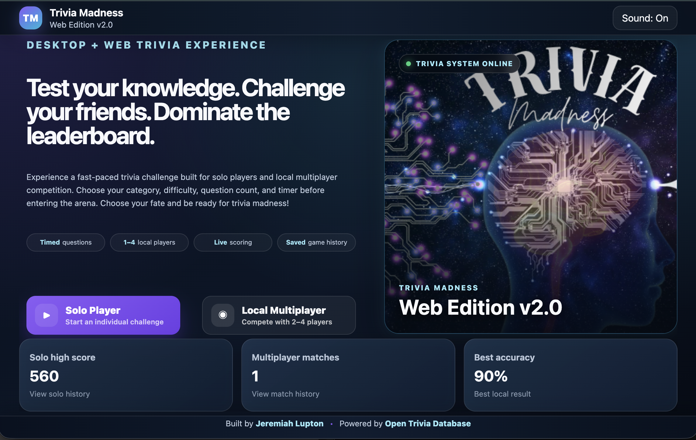
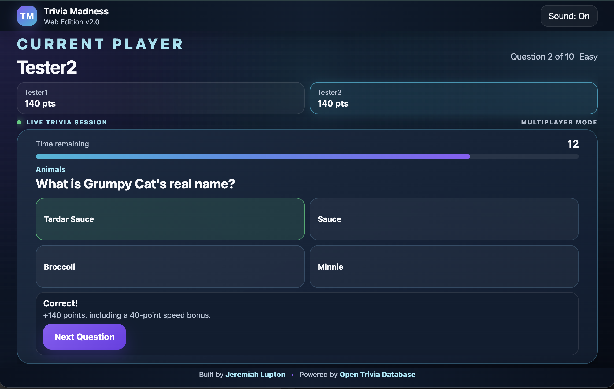
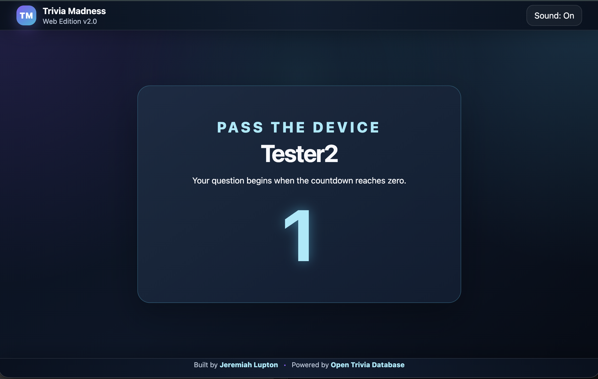
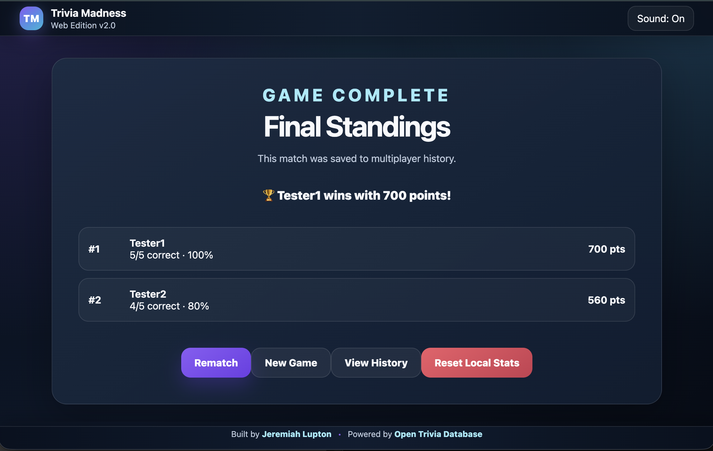

# Trivia Madness Web Edition v2.0


Trivia Madness is a multi-platform trivia game featuring a Java Swing desktop application and a responsive web edition. Players can test their knowledge in solo mode or compete with friends using local multiplayer.

The project combines a desktop game experience with a browser-based version powered by the Open Trivia Database.

## Project Versions

### Desktop Edition v1.0

The original Trivia Madness desktop application was developed with Java Swing and SQLite.

Desktop features include:

* Java Swing graphical interface
* Category and difficulty selection
* Timed trivia questions
* Open Trivia Database integration
* Persistent local leaderboard
* SQLite score storage
* Player settings
* Countdown timer
* Score tracking
* Restart and replay functionality

### Web Edition v2.0

The web edition provides a responsive browser-based trivia experience that can be accessed through GitHub Pages.

Web features include:

* Solo player mode
* Local multiplayer for 2–4 players
* Category selection
* Easy, medium, hard, or mixed difficulty
* Configurable question counts
* Configurable question timer
* Speed-based bonus scoring
* Multiplayer device handoff countdown
* Solo high-score tracking
* Multiplayer match history
* Best accuracy tracking
* Local browser storage
* Sound controls
* Responsive desktop, tablet, and mobile layout
* Futuristic animated interface
* Pulsating hero artwork
* Live trivia session HUD
* Open Trivia Database integration

## Live Web Application

Play Trivia Madness Web Edition:

[Open Trivia Madness](https://jd-dev-king.github.io/Trivia-Madness-Game/)

## Technologies Used

### Desktop Application

* Java
* Java Swing
* Maven
* SQLite
* JDBC
* Open Trivia Database API
* IntelliJ IDEA

### Web Application

* HTML5
* CSS3
* JavaScript
* Local Storage
* Open Trivia Database API
* GitHub Pages

## Project Structure

```text
Trivia-Madness-Game/
├── src/
│   └── main/
│       └── java/
│           └── com/
│               └── jeremiah/
│                   └── triviagame/
│                       ├── Main.java
│                       ├── api/
│                       ├── database/
│                       ├── model/
│                       ├── repository/
│                       └── ui/
├── docs/
│   ├── images/    
│   │   └── trivia-hero.png
│   ├── index.html
│   ├── style.css
│   └── script.js
├── pom.xml
└── README.md
```

## Web Edition Gameplay

### Solo Mode

Solo mode allows one player to complete a trivia session and compare the final score with locally stored results.

The game tracks:

* Total score
* Correct answers
* Accuracy percentage
* High score
* Solo game history

### Local Multiplayer

Local multiplayer supports between two and four players using the same device.

Each player receives a device handoff countdown before their question begins. At the end of the match, the application displays the final rankings and winner.

The game tracks:

* Player scores
* Correct answers
* Speed bonuses
* Match rankings
* Multiplayer history

## Scoring System

Players earn:

* 100 points for each correct answer
* Up to 50 additional points based on response speed

Incorrect answers and expired timers do not award points.

## Running the Web Edition Locally

Clone the repository:

```bash
git clone https://github.com/jd-dev-king/Trivia-Madness-Game.git
```

Move into the project directory:

```bash
cd Trivia-Madness-Game
```

Open the `docs` folder in Visual Studio Code and launch `index.html` using the Live Server extension.

You can also open the file directly in a browser:

```text
docs/index.html
```

For the best results, use Live Server because some browser features may behave differently when the page is opened directly from the local file system.

## Running the Desktop Edition

Make sure Java and Maven are installed.

Clone the repository:

```bash
git clone https://github.com/jd-dev-king/Trivia-Madness-Game.git
```

Move into the project directory:

```bash
cd Trivia-Madness-Game
```

Build the project:

```bash
mvn clean package
```

Run the application through IntelliJ IDEA or execute the generated JAR from the `target` folder.

You can also run the project with Maven:

```bash
mvn exec:java
```

## Open Trivia Database

Trivia questions and categories are provided by the Open Trivia Database.

The application retrieves question data dynamically based on the selected:

* Category
* Difficulty
* Number of questions
* Game mode

Because the application depends on an external API, an internet connection is required to load new trivia questions.

## Local Data Storage

The web edition stores game statistics in the browser using Local Storage.

Stored information may include:

* Solo high score
* Solo game history
* Multiplayer match history
* Best recorded accuracy
* Sound preference

This information remains on the current browser and device unless the user resets the local statistics or clears browser data.

The desktop edition stores score information locally using SQLite.

## Responsive Design

The web interface automatically adjusts for:

* Large desktop monitors
* Laptop screens
* Tablets
* Mobile devices

The desktop layout is designed to fit within the available viewport while preserving access to the header, game area, statistics cards, and footer.

On smaller screens, the application switches to a vertically stacked layout with natural scrolling for usability.

## GitHub Pages Deployment

The GitHub Pages site is deployed from the repository's `docs` folder.

The web application files are:

```text
docs/index.html
docs/style.css
docs/script.js
docs/images/trivia-hero.png
```

After changes are committed and pushed to the `main` branch, GitHub Pages automatically rebuilds the live website.

## Future Enhancements

Planned improvements may include:

* Player avatars
* Online multiplayer
* Additional sound effects
* Animated transitions
* Expanded achievements
* Category performance analytics
* Custom question packs
* Progressive Web App support
* Additional accessibility settings
* Difficulty-based leaderboards

## Screenshots










## Repository

[View the Trivia Madness source code on GitHub](https://github.com/jd-dev-king/Trivia-Madness-Game)

## Author

Built by [Jeremiah Lupton](https://jeremiahlupton.com)

## Acknowledgments

Trivia questions are powered by the [Open Trivia Database](https://opentdb.com).

## License

This project is intended for educational, portfolio, and demonstration purposes.

