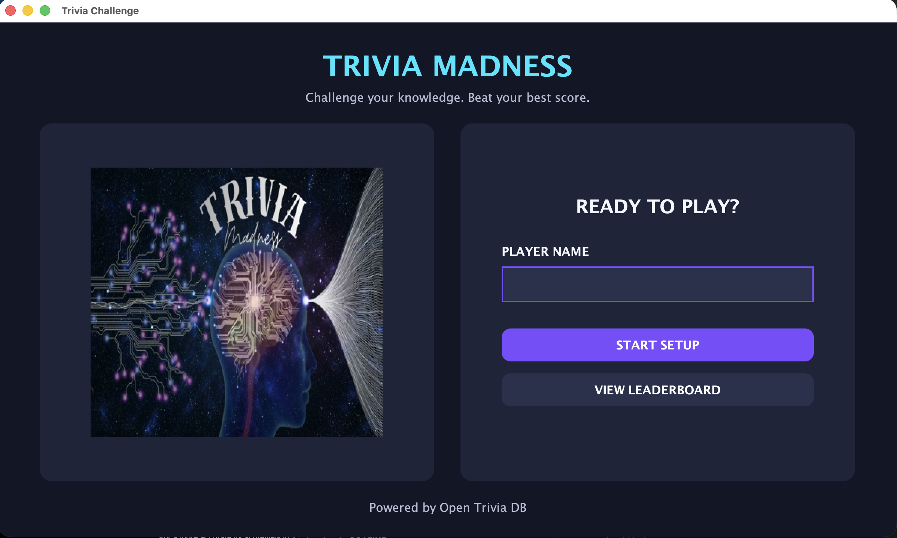
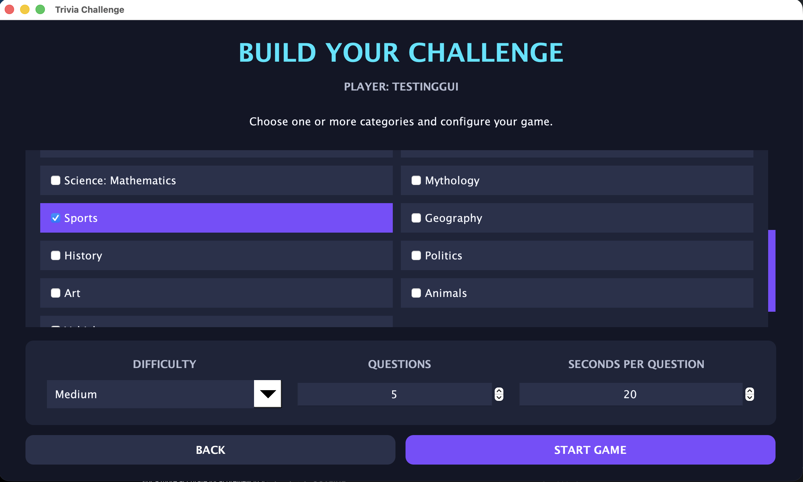
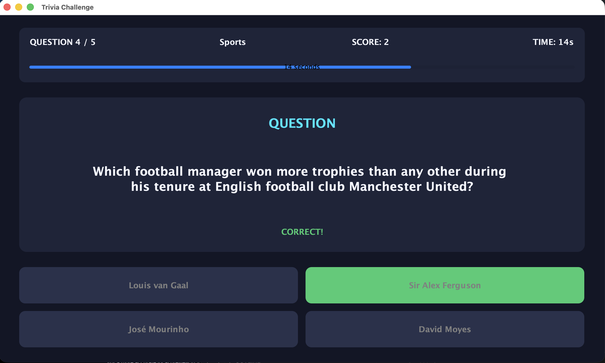
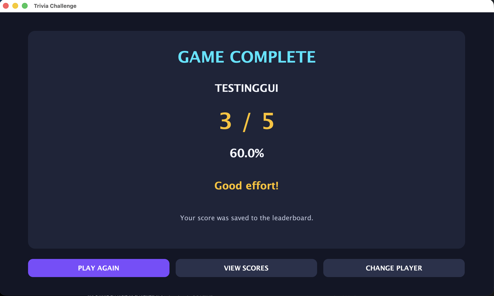
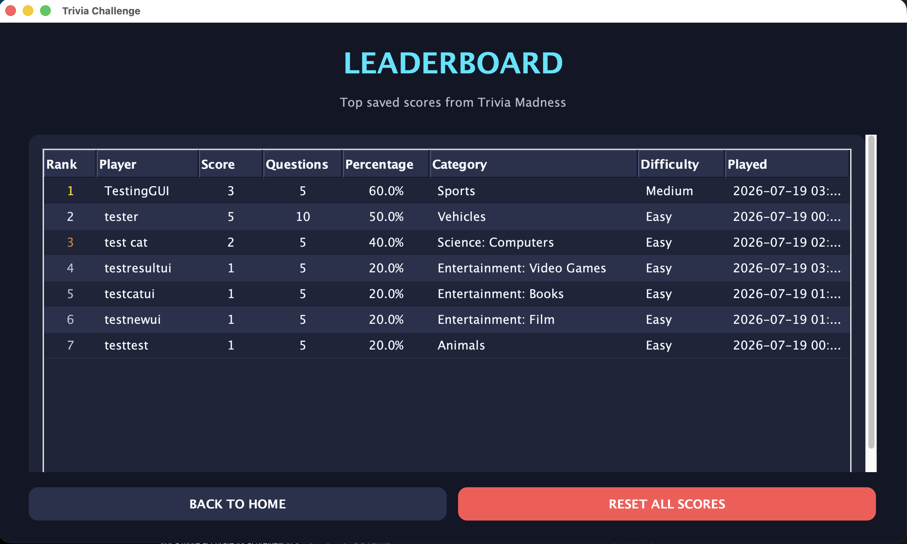

# Trivia Madness Game

A Java desktop trivia game built with Swing, SQLite, Maven, and the Open Trivia Database API.

The application allows players to select multiple categories, configure game difficulty, choose the number of questions, answer timed trivia questions, and save their results to a persistent local leaderboard.

## Features

* Java Swing graphical user interface
* Player-name entry
* Multi-category selection
* Easy, medium, hard, or mixed difficulty
* Configurable question count
* Configurable countdown timer
* Questions retrieved from Open Trivia DB
* Randomized answer order
* Visual timer progress bar
* Correct and incorrect answer feedback
* Automatic score calculation
* SQLite score persistence
* Saved-score leaderboard
* Score reset confirmation
* Performance feedback after each game
* Safe application exit confirmation
* API and database error handling

## Screenshots

### Welcome Screen



### Category Selection



### Trivia Question



### Answer Feedback


### Results



### Leaderboard



## Technologies

* Java
* Java Swing
* Maven
* SQLite
* JDBC
* Gson
* Java HTTP Client
* Open Trivia Database API
* IntelliJ IDEA

## Project Structure

```text
TriviaGame
├── data
│   └── .gitkeep
├── docs
│   └── images
├── src
│   └── main
│       └── java
│           └── com
│               └── jeremiah
│                   └── triviagame
│                       ├── Main.java
│                       ├── api
│                       │   └── TriviaApiClient.java
│                       ├── database
│                       │   ├── DatabaseManager.java
│                       │   └── ScoreRepository.java
│                       ├── model
│                       │   ├── Category.java
│                       │   ├── GameSettings.java
│                       │   ├── Question.java
│                       │   └── Score.java
│                       └── ui
│                           ├── CategoryPanel.java
│                           ├── GamePanel.java
│                           ├── LeaderboardPanel.java
│                           ├── MainFrame.java
│                           └── WelcomePanel.java
├── .gitignore
├── pom.xml
└── README.md
```

## How the Application Works

1. The player enters a name.
2. The player selects one or more trivia categories.
3. The player chooses the difficulty, question count, and timer length.
4. The application requests questions from Open Trivia DB.
5. The answers are shuffled before each question is displayed.
6. The timer counts down while the player chooses an answer.
7. The application displays immediate visual feedback.
8. The final score is saved to SQLite.
9. Previous scores can be viewed or reset from the leaderboard.

## Database

The application creates a local SQLite database automatically:

```text
data/trivia_game.db
```

The database stores:

* Player name
* Score
* Total questions
* Percentage
* Selected categories
* Difficulty
* Date and time played

The database file is excluded from Git so local player scores are not uploaded to the repository.

## Open Trivia DB

Trivia questions are retrieved from the Open Trivia Database.

No API key is required.

The application requests Base64-encoded multiple-choice questions and decodes them before displaying them in the GUI.

Internet access is required to begin a new game.

## Requirements

* Java Development Kit
* Maven
* Internet connection
* IntelliJ IDEA or another Java IDE

The project was developed using a modern Java JDK. The Java version configured in `pom.xml` must match an installed JDK.

## Running the Project in IntelliJ

1. Clone or download the repository.
2. Open IntelliJ IDEA.
3. Select **Open**.
4. Open the project folder or its `pom.xml`.
5. Allow Maven to download the required dependencies.
6. Confirm that the correct JDK is selected.
7. Open `Main.java`.
8. Run `Main.main()`.

## Maven Dependencies

The project uses:

* Gson for JSON parsing
* SQLite JDBC for database access

Maven downloads both dependencies automatically from the configuration in `pom.xml`.

## Error Handling

The application handles common problems including:

* Missing player name
* No selected category
* Internet connection failures
* Open Trivia DB response errors
* Empty question responses
* SQLite save and retrieval errors
* Accidental score resets
* Accidental application closure

## Future Improvements

* Dark mode
* Sound effects
* Custom application icon
* Offline fallback questions
* User profiles
* Per-category statistics
* High-score filtering
* Achievement badges
* Packaged macOS, Windows, and Linux releases
* Automated tests

## Author

Jeremiah Lupton

## Version

Version 1.0.0
